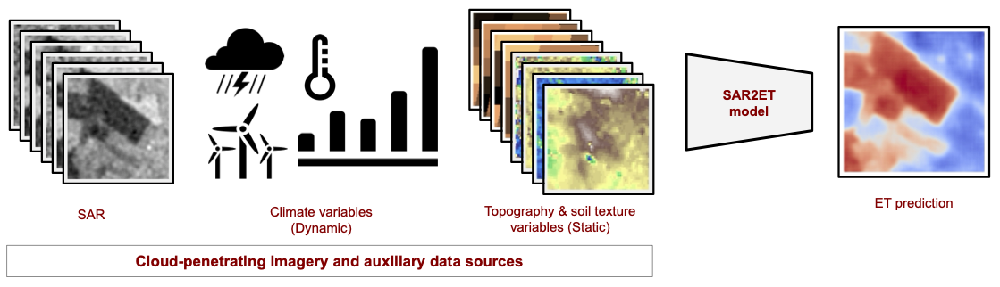

# sar-based-et-estimation

## Introduction
<p align="justify"> 
We developed multiple SAR2ET models that are trained with different combinations of various static (topographical and soil texture data) and dynamic (meteorological data and soil moisture) data along with the SAR. These secondary data sources were incorporated during the SAR2ET model training and had a significant impact on improving ET estimation performance when combined with SAR. The resulting SAR2ET approach is summarized as an illustration in the figure below.
</p>
<p align="center">
  
</p>


## Getting Started
Please follow the steps below to install and run the best-performing SAR-based ET estimation model.

### System requirements
<p align="justify"> 
SAR-based ET estimation models are built and tested on an Ubuntu 20.04 environment with a single GPU of NVIDIA GeForce RTX 3090 Ti on the CUDA 12.0 platform using PyTorch 2.0.1.
</p>


### Installation
1. Clone the repository to your local.
```
git clone https://github.com/cetinsamet/sar-based-et-estimation.git
```
 
2. Build the conda environment from yml and activate the environment.
```
# move to the main directory
cd sar-based-et-estimation

# create conda environment from the file
conda env create -f environment.yml

# activate conda environment
conda activate sar-based-et-estimation
```

3. Retrieve the pretrained model weights and place it under ```models/``` directory.

## Run
<p align="justify"> 
To run the best-performing SAR-based ET estimation model (trained with SAR, ERA5, and DEM), simply call the ```predict_et.py``` script by providing the file path to the pre-trained model weights, file paths to the model input tensors (SAR, ERA5, and DEM tensors) and the type of device (cpu/cuda) to run the model.
</p> 

```
python predict_et.py \
    --pretrained_model=<path-to-pretrained-model-weights> \
    --s1_tensor=<path-to-S1-tensor> \
    --era5_tensor=<path-to-ERA5-tensor> \
    --dem_tensor=<path-to-DEM-tensor> \
    --device=<device-to-use-for-inference>
```

An example run would be:
```
python predict_et.py \
    --pretrained_model WORKDIR/sar-based-et-estimation/models/et-estimator.pt \
    --s1_tensor WORKDIR/sar-based-et-estimation/data/tensors/s1/s1_0001.pt \
    --era5_tensor WORKDIR/sar-based-et-estimation/data/tensors/era5/era5_0001.pt \
    --dem_tensor WORKDIR/sar-based-et-estimation/data/tensors/dem/dem_0001.pt \
    --device cuda
```

## Results

<p align="justify"> 
We thoroughly evaluate various SAR2ET models that estimate ET using different combinations of static and dynamic data sources. We analyze seasonal and regional differences by evaluating these models across different study areas to identify any regional disparities and analyze R2 scores on a monthly basis for the year 2021. We use tables to provide a detailed comparison of the models, highlighting their strengths and weaknesses, and showing the impact of different data sources on ET estimation accuracy. We also provide qualitative results to further examine the models’ performance.
</p>

### Quantitative results

<p align="justify"> 
Table 2 shows the performance metrics of various SAR2ET models that are trained using different combinations of static and dynamic data sources, on the test set. 
The baseline SAR model achieves an MSE of 0.94, an MAE of 0.72, and a R2 of 0.63. 
However, as auxiliary static and dynamic data sources are added to the models, their performance further improves. 
The best model in this comparison incorporates SAR, ERA5, and DEM data, achieving an outstanding MSE of 0.46, an MAE of 0.49, and a R2 of 0.82 (a 19-point improvement over the baseline). 
This underscores the synergistic benefits of combining both static and dynamic data sources and emphasizes the importance of integrating SAR, DEM, and ERA5 data to enhance the accuracy of SAR2ET models for estimating ET.
</p>
<p align="center">
  
</p>

<p align="justify"> 
Table 3 provides a detailed comparison of multiple SAR2ET models, each trained with a combination of static and dynamic data sources, for the purpose of estimating ET over the course of the study year 2021. 
The primary focus of this analysis is the variation in R2 scores across different time intervals (months of the year), shedding light on the models’ performance throughout the year. 
The baseline SAR model starts with relatively lower R2 values in March (0.37) and April (0.31) but gradually improves its performance as the year progresses, achieving its highest R2 scores in July (0.63) and August (0.68). 
As additional data sources are incorporated into the models, the R2 scores generally show improvement across all months. 
The model trained with SAR, ERA5, and DEM data consistently outperforms others, with the highest R2 scores across all months, notably achieving a remarkable R2 of 0.85 in August. 
This demonstrates that combining SAR with dynamic (meteorological) and static (topographical) data significantly enhances the model’s ability to estimate ET throughout the year.
Overall, the table illustrates the importance of data integration in SAR2ET modeling and highlights how the accuracy of ET estimation varies by month, with SAR-based models becoming more effective in capturing ET dynamics during the warmer months of the year when water-related processes are more active. 	
</p>
<p align="center">
  
</p>

<p align="justify"> 
Table 4 demonstrates notable improvements in the overall performance of SAR2ET models across various geographic regions. 
Initially, the SAR model exhibits moderate accuracy in estimating ET, with R2 scores ranging from 0.56 to 0.71 across different regions. 
  However, as additional static data sources such as SoilGrids and DEM are integrated into the models, a consistent enhancement in R2 scores is evident. 
  The most remarkable performance improvement is observed in the model trained with SAR, ERA5, and DEM data, where R2 scores reach their maximum when both the most significant static (DEM) and dynamic (ERA5) data sources are present. 
  In areas like the Balkans (B) and Central Anatolia (CA), this model has shown remarkable R2 values of up to 0.86 and 0.83, respectively. 
  These values represent a significant improvement of 15 and 21 points over the baseline and indicate a robust correlation between model predictions and observed ET data. 
  These findings emphasize the importance of combining topographical data (DEM) and meteorological data (ERA5) in SAR-based ET estimation, especially in areas where these variables significantly influence ET dynamics. 
</p>
<p align="center">
  
</p>

### Qualitative results
<p align="justify">
The below figures illustrate the comparison between ground truth ET and predicted ETs made by different SAR-based ET estimations.
The figures suggest that the SAR2ET model, which harnesses the synergy of meteorological data, topographical features, and SAR, emerges as the most robust and accurate predictor of ET.
This combined approach allows the model to effectively capture micro-seasonal weather patterns and local topographical structures. 
Consequently, it consistently delivers ET predictions that closely align with the target values. 
</p>

<p align="center">
  
</p>

### Acknowledgements
<p align="justify"> 
This project entitled ”Improving Resiliency of Malian Farmers with Yield Estimation: IMPRESSYIELD” was funded by the Climate Change AI Innovation Grants program, hosted by Climate Change AI with the additional support of the Canada Hub of Future Earth.
</p> 
